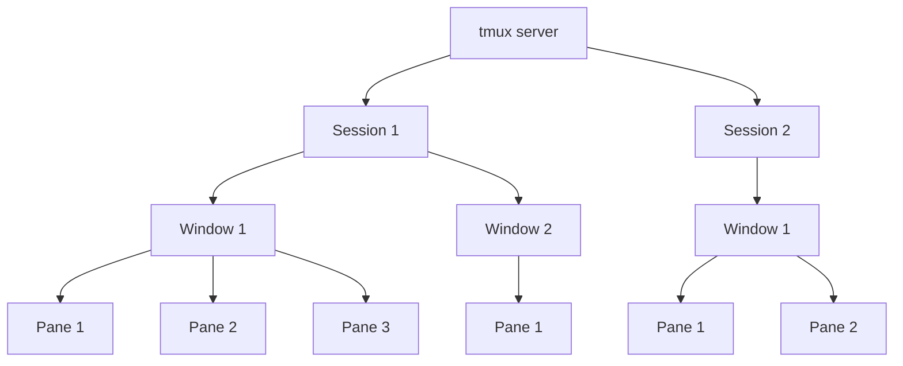

# Tmux Setup

## Table of Contents

- [Installation](#installation)
- [Concepts](#concepts)
- [Sessions](#sessions)
- [Windows](#windows)
- [Panes](#panes)
- [Copy Mode](#copy-mode)
- [Miscellaneous](#miscellaneous)

## Installation

See the official installation guide: [tmux/tmux](https://github.com/tmux/tmux/wiki/Installing)

## Concepts

Tmux uses a hierarchy of sessions, windows, and panes.

## Sessions

The default prefix key is `Ctrl-b`, shown as `prefix` below.

| Command | Action |
|---------|--------|
| `tmux` | Start a new session |
| `tmux new -s name` | Start a new session with name |
| `tmux ls` | List sessions |
| `tmux a` | Attach to last session |
| `tmux a -t name` | Attach to named session |
| `tmux kill-session -t name` | Kill named session |
| `prefix d` | Detach from session |
| `prefix s` | List and switch sessions |
| `prefix $` | Rename session |

## Windows

Windows and panes are numbered starting at 1. Mouse is enabled for clicking windows, panes, and scrolling.

| Command | Action |
|---------|--------|
| `prefix c` | Create new window |
| `prefix ,` | Rename current window |
| `prefix w` | List windows |
| `prefix n` | Next window |
| `prefix p` | Previous window |
| `prefix 1-9` | Switch to window by number |
| `prefix &` | Kill current window |

## Panes

### Splitting

Splits open in the current working directory.

| Command | Action |
|---------|--------|
| `prefix %` | Split pane horizontally |
| `prefix "` | Split pane vertically |

### Selecting

Pane navigation is handled by [vim-tmux-navigator](https://github.com/christoomey/vim-tmux-navigator) — use `Ctrl-h/j/k/l` to move between tmux panes and Vim splits seamlessly.

| Command | Action |
|---------|--------|
| `Ctrl-h` | Select pane left |
| `Ctrl-j` | Select pane down |
| `Ctrl-k` | Select pane up |
| `Ctrl-l` | Select pane right |
| `prefix o` | Cycle through panes |
| `prefix q` | Show pane numbers |
| `prefix q 1-9` | Switch to pane by number |
| `prefix ;` | Switch to last active pane |

### Resizing

Repeatable — hold prefix and press the key multiple times.

| Command | Action |
|---------|--------|
| `prefix H` | Resize pane left by 5 |
| `prefix J` | Resize pane down by 5 |
| `prefix K` | Resize pane up by 5 |
| `prefix L` | Resize pane right by 5 |

### Other

| Command | Action |
|---------|--------|
| `prefix z` | Toggle pane zoom |
| `prefix {` | Move pane left |
| `prefix }` | Move pane right |
| `prefix x` | Kill current pane |
| `prefix Space` | Cycle pane layouts |

## Copy Mode

| Command | Action |
|---------|--------|
| `prefix [` | Enter copy mode |
| `q` | Exit copy mode |
| `Space` | Start selection |
| `Enter` | Copy selection |
| `prefix ]` | Paste buffer |
| `/` | Search forward |
| `?` | Search backward |
| `n` | Next search match |
| `N` | Previous search match |

## Miscellaneous

| Command | Action |
|---------|--------|
| `prefix :` | Enter command mode |
| `prefix t` | Show clock |
| `prefix ?` | List key bindings |
| `tmux source ~/.config/tmux/tmux.conf` | Reload config |
| `tmux kill-server` | Kill tmux server and all sessions |
